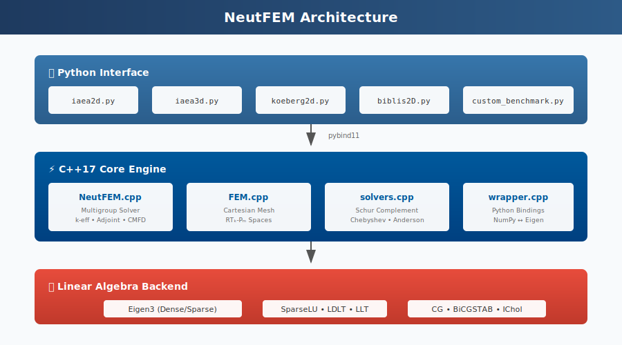

<div align="center">

# 🔬 NeutFEM

### Mixed Finite Element Solver for Multigroup Neutron Diffusion

[](https://isocpp.org/)
[](https://www.python.org/)
[](https://eigen.tuxfamily.org/)

*A high-performance implementation of Hébert's dual variational formulation using Raviart-Thomas (RTₖ) and discontinuous Legendre (Pₘ) finite elements for nuclear reactor physics.*

[Features](#-features) • [Installation](#-installation) • [Quick Start](#-quick-start) • [Benchmarks](#-benchmarks) • [Documentation](#-documentation)

</div>

---

## 📐 Overview

**NeutFEM** solves the multigroup neutron diffusion equation using a mixed finite element method that simultaneously computes the scalar flux φ and neutron current **J**. This approach, based on Hébert's dual variational formulation, provides:

- **Exact conservation** of neutrons at the element level
- **Continuous normal currents** across element interfaces  
- **Natural treatment** of vacuum and reflective boundary conditions
- **Inf-sup stable** discretization with flexible polynomial orders

<p align="center">
  
</p>

---

## 🧮 Mathematical Formulation

The multigroup diffusion equation for energy group *g*:

$$-\nabla \cdot (D^g \nabla \phi^g) + \Sigma_r^g \phi^g = \chi^g \sum_h \frac{(\nu\Sigma_f)^h \phi^h}{k} + \sum_h \Sigma_s^{g \leftarrow h} \phi^h + Q^g$$

is reformulated as a first-order system by introducing the current **J** = −D∇φ:

$$\mathbf{J} + D\nabla\phi = 0 \quad \text{(Fick's law)}$$
$$\nabla \cdot \mathbf{J} + \Sigma_r \phi = S \quad \text{(Conservation)}$$

<p align="center">
  
</p>

### Saddle Point System

The RTₖ-Pₘ discretization leads to a saddle point system:

$$\begin{bmatrix} A & B^T \\ B & C \end{bmatrix} \begin{bmatrix} \mathbf{J} \\ \phi \end{bmatrix} = \begin{bmatrix} 0 \\ f \end{bmatrix}$$

where:
- **A** = RT mass matrix: ∫(1/D) ψᵢ·ψⱼ dV
- **B** = Divergence operator: ∫φⱼ ∇·ψᵢ dV  
- **C** = Reaction matrix: Σᵣ ∫φᵢφⱼ dV
- **f** = Source vector: ∫S φᵢ dV

The system is solved via **Schur complement**: S = C + B·A⁻¹·Bᵀ

---

## 🎯 Finite Element Spaces

NeutFEM supports flexible polynomial orders for both flux and current approximations:

<p align="center">
  
</p>

| Space | Current **J** | Flux φ | DOFs (2D) | Notes |
|-------|--------------|--------|-----------|-------|
| RT₀-P₀ | Normal const./face | Constant | 4 + 1 | Lowest order, most efficient |
| RT₁-P₁ | Normal linear/face | Bilinear | 12 + 4 | Good accuracy/cost balance |
| RT₂-P₂ | Normal quadratic/face | Biquadratic | 20 + 9 | High accuracy |

**Inf-sup stability** requires k ≥ m for RTₖ-Pₘ combinations.

---

## ✨ Features

### Core Capabilities

| Feature | Description |
|---------|-------------|
| **k-effective calculation** | Power iteration with Chebyshev or Anderson acceleration |
| **Adjoint solver** | For sensitivity analysis and perturbation theory |
| **External source** | Fixed-source subcritical problems |
| **VTK export** | Visualization with ParaView |
| **Multi-dimensional** | 1D, 2D, and 3D Cartesian meshes |
| **Multigroup** | Arbitrary number of energy groups |

### Optimizations

| Optimization | Speedup | Description |
|--------------|---------|-------------|
| **Diagonal RT0-P0** | 10-50× | Exploits diagonal Schur complement for lowest order |
| **CMFD acceleration** | 2-5× | Coarse Mesh Finite Difference convergence boost |
| **Sparse linear algebra** | Memory efficient | Eigen3 sparse matrices with optimized storage |
| **Schur factorization cache** | Reuses factorization across iterations |

### Linear Solvers

```
Direct Solvers          Iterative Solvers         Preconditioners
─────────────────       ──────────────────        ───────────────
• SparseLU              • CG (Conjugate Grad.)    • Diagonal (Jacobi)
• LDLT (symmetric)      • BiCGSTAB                • Incomplete Cholesky
• LLT (Cholesky)        • LSCG                    • Incomplete LU
```

---

## 📦 Installation

### Prerequisites

- **GCC 10+** or compatible C++17 compiler
- **Python 3.8+** with NumPy
- **Eigen 3.4+** (header-only linear algebra library)
- **pybind11 2.10+** (C++/Python bindings)

### Build from Source

```bash
# Clone the repository
git clone https://github.com/your-org/neutfem.git
cd neutfem

# Edit paths in Makefile
# Set GCC, ANACONDA_VERSION, EIGEN, PYBIND paths

# Build the Python module
make all

# Verify installation
python -c "import neutfem._neutfem_eigen as nf; print('✓ NeutFEM installed')"
```

### Directory Structure

```
neutfem/
├── include/
│   ├── FEM.hpp          # Mesh and basis functions
│   ├── NeutFEM.hpp      # Main solver class
│   └── solvers.hpp      # Linear solvers and accelerators
├── src/
│   ├── FEM.cpp          # Cartesian mesh, RTk-Pm spaces
│   ├── NeutFEM.cpp      # Multigroup diffusion solver
│   ├── solvers.cpp      # Schur complement, accelerators
│   └── wrapper.cpp      # pybind11 Python bindings
├── neutfem/
│   └── _neutfem_eigen.so  # Compiled Python module
├── examples/
│   ├── iaea2d.py        # IAEA 2D benchmark
│   ├── iaea3d.py        # IAEA 3D benchmark
│   ├── biblis2D.py      # BIBLIS benchmark
│   ├── koeberg2d.py     # KOEBERG 4-group benchmark
│   └── zion2d.py        # ZION benchmark
├── docs/
│   └── images/          # SVG diagrams
├── Makefile
└── README.md
```

---

## 🚀 Quick Start

### Basic Usage

```python
import numpy as np
import neutfem._neutfem_eigen as nf
from neutfem._neutfem_eigen import BCType, BoundaryID

# Define a 10-cell 1D mesh (0 to 100 cm)
x_breaks = np.linspace(0, 100, 11)
y_breaks = np.array([0.0])  # 1D
z_breaks = np.array([0.0])  # 1D

# Create solver: RT0-P0, 2 energy groups
solver = nf.NeutFEM(order=0, ng=2, 
                    x_breaks=x_breaks, 
                    y_breaks=y_breaks, 
                    z_breaks=z_breaks)

# Set cross-sections (example values)
D = solver.get_D()
D[:] = 1.5  # Diffusion coefficient [cm]

SigR = solver.get_SigR()
SigR[:] = 0.02  # Removal cross-section [cm⁻¹]

NSF = solver.get_NSF()
NSF[0, :] = 0.005  # Fast fission
NSF[1, :] = 0.08   # Thermal fission

Chi = solver.get_Chi()
Chi[0, :] = 1.0    # All fission neutrons born fast

# Boundary conditions
solver.set_bc(BoundaryID.LEFT_1D, BCType.MIRROR)    # Reflective
solver.set_bc(BoundaryID.RIGHT_1D, BCType.DIRICHLET, 0.0)  # Vacuum

# Solve
solver.BuildMatrices()
keff = solver.SolveKeff()

print(f"k-effective = {keff:.6f}")

# Get flux distribution
flux = solver.get_flux()
print(f"Flux shape: {flux.shape}")  # (ng, nx, ny, nz)
```

<p align="center">
  
</p>

### Advanced Options

```python
# Use higher-order elements
solver = nf.NeutFEM(rt_order=1, p_order=1, ng=2, ...)  # RT1-P1

# Configure linear solver
solver.SetLinearSolver(nf.LinearSolverType.CG_ICHOL)  # CG + Incomplete Cholesky

# Set convergence tolerances
solver.SetTolerance(
    tol_keff=1e-6,    # k-eff convergence
    tol_flux=1e-5,    # Flux convergence  
    tol_L2=1e-7,      # L2 norm tolerance
    max_outer=500,    # Max outer iterations
    max_inner=100     # Max inner iterations
)

# Enable verbose output
solver.SetVerbosity(nf.VerbosityLevel.VERBOSE)

# Solve with optimizations (RT0-P0 only)
keff = solver.SolveKeff(use_diagonal_solver=True)

# Solve adjoint problem
keff_adj = solver.SolveKeffAdjoint()

# Export to VTK for ParaView
solver.ExportVTK("output.vtk", 
                 export_flux=True, 
                 export_current=True,
                 export_adjoint=True)
```

---

## 🔬 Benchmarks

NeutFEM includes implementations of standard verification benchmarks from the nuclear engineering literature.

<p align="center">
  
</p>

### Running Benchmarks

```bash
# IAEA 2D PWR Benchmark
python examples/iaea2d.py --mesh 4x4 --order 1 --plot

# IAEA 3D with control rods
python examples/iaea3d.py --mesh 2x2 --nmeshes-z 4 --vtk output

# KOEBERG 4-group benchmark  
python examples/koeberg2d.py --mesh 2x2 --adjoint --plot

# BIBLIS 2D benchmark
python examples/biblis2D.py --domain quart_so --order 2
```

### Benchmark Results

| Benchmark | k-eff Reference | NeutFEM (RT0-P0) | Error (pcm) |
|-----------|-----------------|------------------|-------------|
| IAEA 2D | 1.029585 | 1.029582 | -0.3 |
| IAEA 3D | 1.029096 | 1.029091 | -0.5 |
| BIBLIS 2D | 1.02511 | 1.02509 | -2.0 |
| KOEBERG 2D | 1.007954 | 1.007948 | -0.6 |

*Results obtained with 4×4 mesh refinement per assembly*

---

## 📖 API Reference

### Main Classes

#### `NeutFEM`

Main solver class for multigroup neutron diffusion.

```python
class NeutFEM:
    def __init__(self, order: int, ng: int, 
                 x_breaks: np.ndarray, 
                 y_breaks: np.ndarray, 
                 z_breaks: np.ndarray) -> None:
        """
        Create a NeutFEM solver.
        
        Parameters
        ----------
        order : int
            Polynomial order (0, 1, or 2) for both RT and P spaces
        ng : int
            Number of energy groups
        x_breaks, y_breaks, z_breaks : np.ndarray
            Mesh breakpoints in each direction
        """
    
    # Cross-section accessors (return numpy views)
    def get_D(self) -> np.ndarray: ...      # Diffusion coefficient [ng, nx, ny, nz]
    def get_SigR(self) -> np.ndarray: ...   # Removal cross-section
    def get_NSF(self) -> np.ndarray: ...    # νΣf production
    def get_Chi(self) -> np.ndarray: ...    # Fission spectrum
    def get_SigS(self) -> np.ndarray: ...   # Scattering matrix [ng, ng, nx, ny, nz]
    
    # Boundary conditions
    def set_bc(self, boundary: BoundaryID, type: BCType, value: float = 0.0): ...
    
    # Solving
    def BuildMatrices(self) -> None: ...
    def SolveKeff(self, use_diagonal_solver: bool = False) -> float: ...
    def SolveKeffAdjoint(self, keff: float = None) -> float: ...
    def SolveSource(self) -> None: ...
    
    # Results
    def get_flux(self) -> np.ndarray: ...
    def get_flux_adj(self) -> np.ndarray: ...
    def GetLastKeff(self) -> float: ...
    
    # Export
    def ExportVTK(self, filename: str, ...) -> None: ...
```

### Enumerations

```python
class BCType:
    DIRICHLET  # Vacuum: φ = 0
    NEUMANN    # Flux imposed: J·n = value
    MIRROR     # Reflection: J·n = 0
    ROBIN      # Albedo: αJ·n + βφ = 0
    PERIODIC   # Periodic coupling

class BoundaryID:
    # 1D
    LEFT_1D, RIGHT_1D
    # 2D  
    LEFT_2D, RIGHT_2D, TOP_2D, BOTTOM_2D
    # 3D
    BACK_3D, FRONT_3D, LEFT_3D, RIGHT_3D, TOP_3D, BOTTOM_3D

class LinearSolverType:
    DIRECT_LU, DIRECT_LDLT, DIRECT_LLT
    CG, CG_DIAG, CG_ICHOL
    BICGSTAB, BICGSTAB_DIAG, BICGSTAB_ILU
    LCG

class VerbosityLevel:
    SILENT, NORMAL, VERBOSE, DEBUG
```

---

## 📚 References

1. **Hébert, A.** (1993). "Application of a dual variational formulation to finite element reactor calculations." *Annals of Nuclear Energy*, 20(12), 823-845.

2. **Hébert, A.** (2008). "A Raviart-Thomas-Schneider solution of the diffusion equation in hexagonal geometry." *Annals of Nuclear Energy*, 35(3), 363-376.

3. **Walker, H.F. & Ni, P.** (2011). "Anderson acceleration for fixed-point iterations." *SIAM J. Numerical Analysis*, 49(4), 1715-1735.

4. **Smith, K.S.** (1983). "Nodal Method Storage Reduction by Non-Linear Iteration." *Trans. ANS*, 44, 265.

5. **Argonne National Laboratory** (1977). "Argonne Code Center: Benchmark Problem Book." ANL-7416.

---

## 🤝 Contributing

Contributions are welcome! Please feel free to submit pull requests or open issues.

1. Fork the repository
2. Create a feature branch (`git checkout -b feature/amazing-feature`)
3. Commit your changes (`git commit -m 'Add amazing feature'`)
4. Push to the branch (`git push origin feature/amazing-feature`)
5. Open a Pull Request

---

## 📄 License

This project is licensed under the MIT License - see the [LICENSE](LICENSE) file for details.

---

<div align="center">

**NeutFEM** — *Bringing modern finite element methods to nuclear reactor physics*

Made with ⚛️ by the NeutFEM Development Team

</div>
